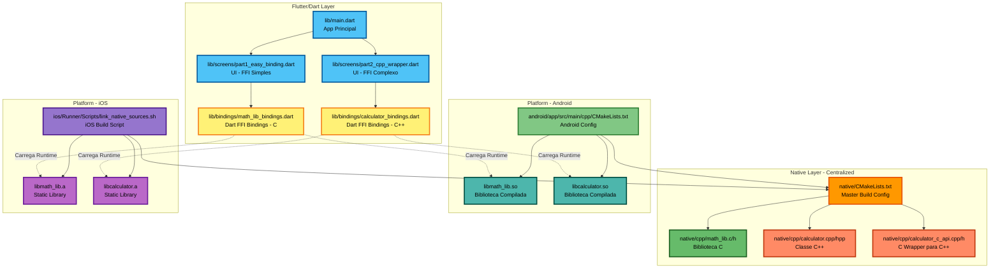
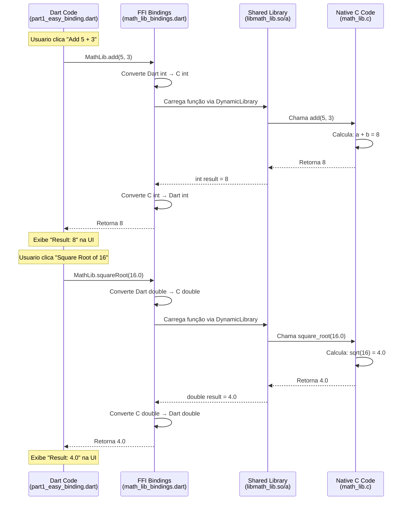
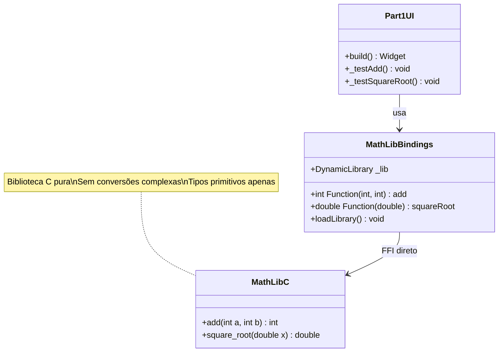
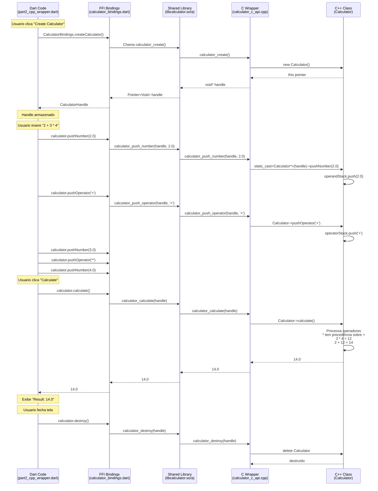
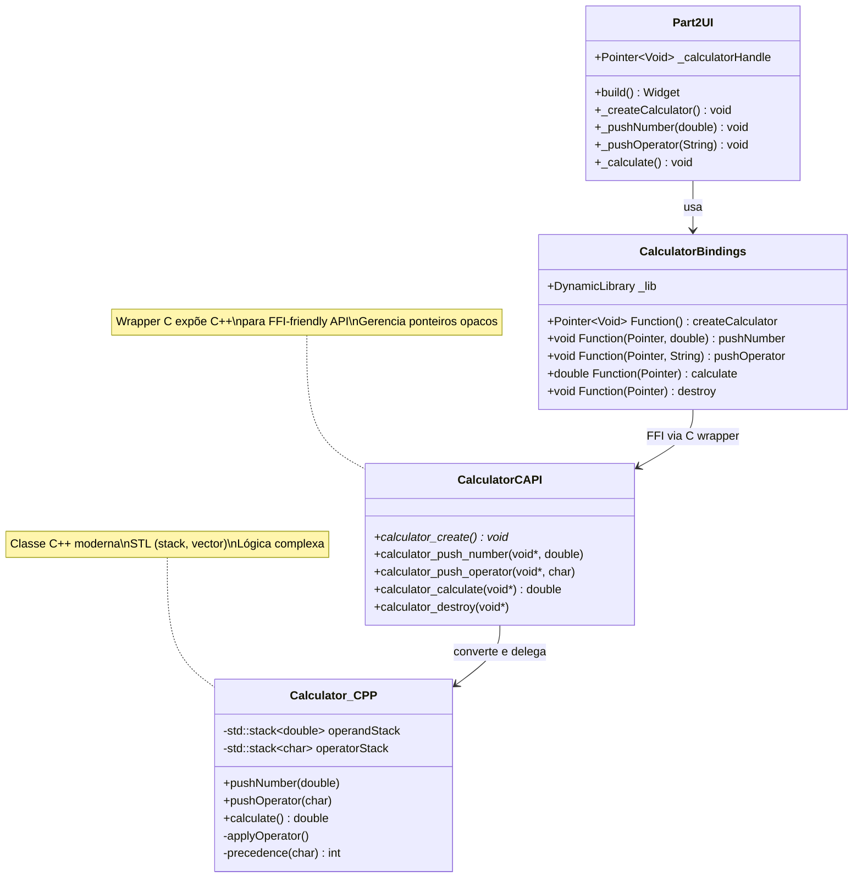
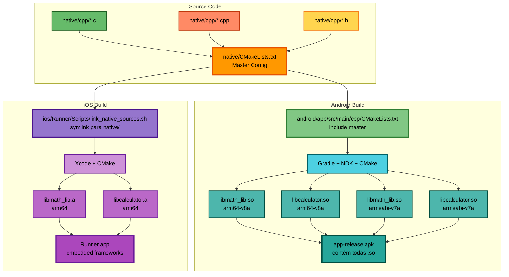
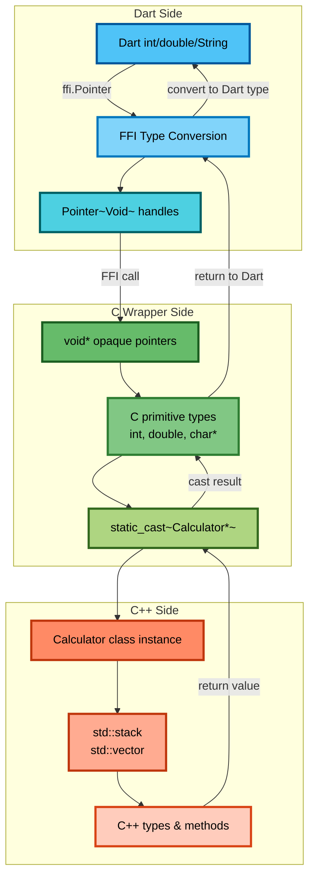

```mermaid
graph LR
    A[Platform CMakeLists<br/>android/ ou ios/] -->|include| B[native/CMakeLists.txt]
    B --> C{CMAKE_CURRENT_LIST_DIR<br/>resolve correto}
    C --> D[native/cpp/math_lib.c]
    C --> E[native/cpp/calculator.cpp]
    C --> F[native/cpp/calculator_c_api.cpp]

    D --> G[add_library math_lib SHARED]
    E --> H[add_library calculator SHARED]
    F --> H

    G --> I[target_link_libraries math_lib m]
    H --> J[target_link_libraries calculator m]

    I --> K[Build Output]
    J --> K

    K -->|Android| L[libmath_lib.so<br/>libcalculator.so]
    K -->|iOS| M[libmath_lib.a<br/>libcalculator.a]

    style A fill:#9575cd,stroke:#4a148c,stroke-width:3px,color:#000
    style B fill:#ff9800,stroke:#e65100,stroke-width:4px,color:#000
    style C fill:#f06292,stroke:#c2185b,stroke-width:3px,color:#fff
    style D fill:#66bb6a,stroke:#1b5e20,stroke-width:2px,color:#000
    style E fill:#ff8a65,stroke:#bf360c,stroke-width:2px,color:#000
    style F fill:#ff8a65,stroke:#bf360c,stroke-width:2px,color:#000
    style G fill:#81c784,stroke:#2e7d32,stroke-width:2px,color:#000
    style H fill:#ffab91,stroke:#bf360c,stroke-width:2px,color:#000
    style I fill:#81c784,stroke:#2e7d32,stroke-width:2px,color:#000
    style J fill:#ffab91,stroke:#bf360c,stroke-width:2px,color:#000
    style K fill:#ffd54f,stroke:#f57f17,stroke-width:3px,color:#000
    style L fill:#4db6ac,stroke:#004d40,stroke-width:3px,color:#000
    style M fill:#ba68c8,stroke:#6a1b9a,stroke-width:3px,color:#000
```

# Launch Screen Assets

You can customize the launch screen with your own desired assets by replacing the image files in this directory.

You can also do it by opening your Flutter project's Xcode project with `open ios/Runner.xcworkspace`, selecting `Runner/Assets.xcassets` in the Project Navigator and dropping in the desired images.

---

# Flutter FFI Implementation Architecture

Este projeto demonstra duas abordagens de FFI (Foreign Function Interface) no Flutter: uma simples (C direto) e uma complexa (C++ com wrapper C).

## 📐 Arquitetura Geral do Projeto



## 🎯 Part 1: FFI Simples (C Direto)

Biblioteca C com funções simples - FFI nativo sem conversões complexas.



### Estrutura Part 1



## 🎯 Part 2: FFI Complexo (C++ com Wrapper C)

Classe C++ moderna exposta via wrapper C para compatibilidade FFI.



### Estrutura Part 2



## 🏗️ Build System - Multiplataforma



## 🔧 CMake Configuration Flow



## 📊 Memory Management & Type Conversion



## 📁 Estrutura de Arquivos

```
dart_ffi_poc/
├── lib/
│   ├── main.dart                           # App principal
│   ├── screens/
│   │   ├── part1_easy_binding.dart         # UI FFI simples
│   │   └── part2_cpp_wrapper.dart          # UI FFI complexo
│   └── bindings/
│       ├── math_lib_bindings.dart          # FFI C direto
│       └── calculator_bindings.dart        # FFI C++ via wrapper
├── native/
│   ├── CMakeLists.txt                      # Master build config
│   └── cpp/
│       ├── math_lib.c/h                    # Biblioteca C
│       ├── calculator.cpp/hpp              # Classe C++
│       └── calculator_c_api.cpp/h          # C wrapper
├── android/
│   └── app/src/main/cpp/
│       └── CMakeLists.txt                  # include(native/CMakeLists.txt)
└── ios/
    └── Runner/Scripts/
        └── link_native_sources.sh          # Symlink para native/
```

## 🎓 Conceitos Demonstrados

### Part 1 (Easy) - FFI Direto
- ✅ Tipos primitivos C (int, double)
- ✅ Funções puras sem estado
- ✅ Conversão automática Dart ↔ C
- ✅ `DynamicLibrary.open()`
- ✅ `lookupFunction<NativeType, DartType>()`

### Part 2 (Complex) - C++ via Wrapper
- ✅ Classes C++ com estado
- ✅ Gerenciamento de ponteiros opacos (`void*`)
- ✅ Lifecycle (create/destroy)
- ✅ STL (std::stack)
- ✅ Lógica complexa (precedência de operadores)
- ✅ String marshalling (char* ↔ String)
- ✅ Wrapper C como ponte FFI-friendly

## 🔑 Pontos-Chave

1. **Centralização**: Todo código nativo em `native/`, compartilhado entre plataformas
2. **CMAKE_CURRENT_LIST_DIR**: Essencial para paths corretos em includes
3. **C Wrapper**: Necessário para expor C++ ao FFI (Dart FFI não suporta C++ direto)
4. **Opaque Pointers**: Gerenciamento de instâncias C++ via `void*` handle
5. **Memory Safety**: Dart não gerencia memória nativa - precisa de destroy() manual
6. **Type Marshalling**: Conversão cuidadosa entre tipos Dart ↔ C

---

📖 Veja `NATIVE_BUILD_FIX.md` para troubleshooting do build nativo.
